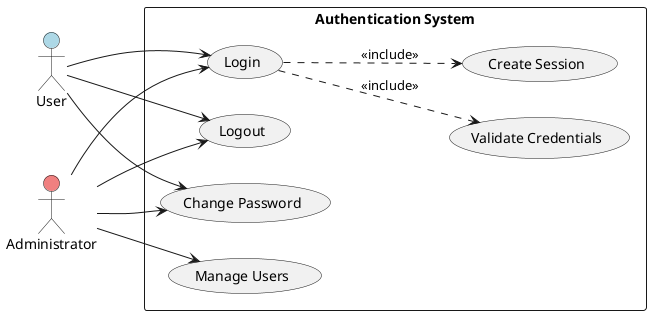
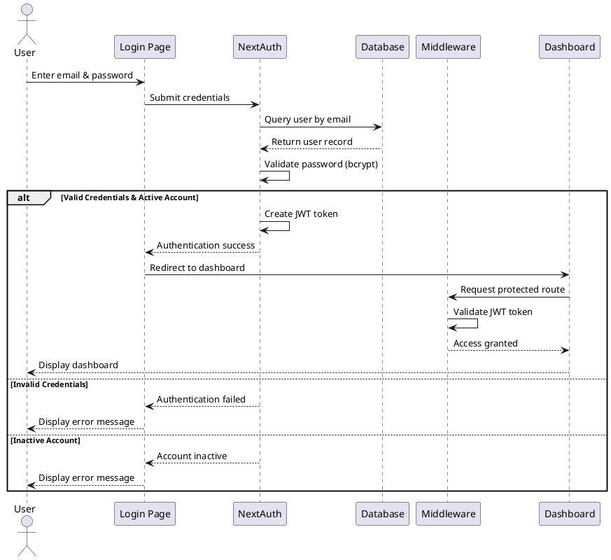
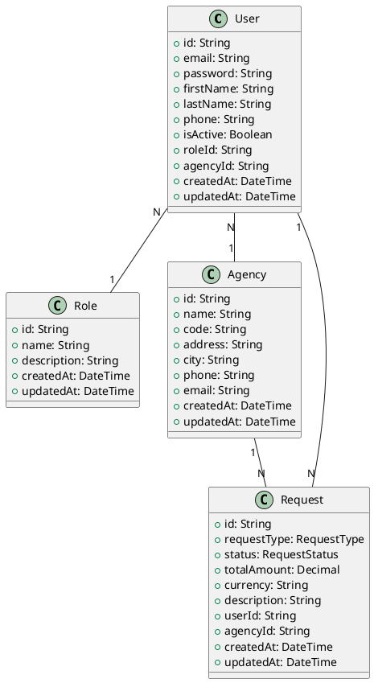
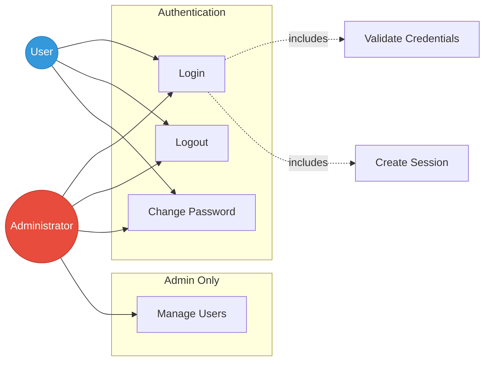
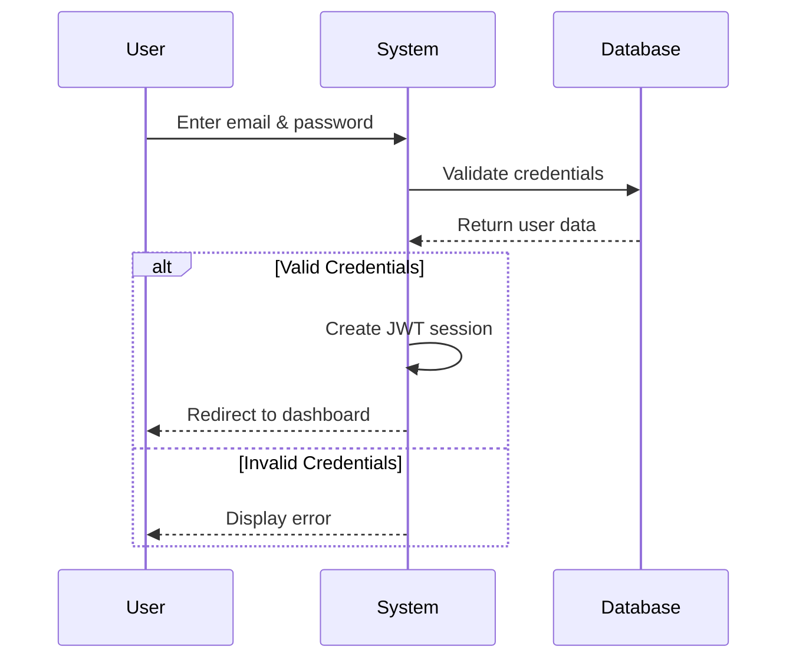

# Authentication Use Case Diagram

## Amen Bank Fund Management System

## PlantUML Use Case Diagram

---

## PlantUML Sequence Diagram

---

## PlantUML Class Diagram

---

## Mermaid Version (Alternative)

## Use Cases

### 1. Login
**Actors:** User, Administrator

**Main Flow:**
1. User enters email and password
2. System validates credentials
3. System creates session with JWT token
4. User is redirected to dashboard

**Alternative Flow:**
- Invalid credentials → Display error message
- Account inactive → Display "Account is inactive"

---

### 2. Logout
**Actors:** User, Administrator

**Main Flow:**
1. User clicks logout button
2. System terminates session
3. User is redirected to login page

---

### 3. Change Password
**Actors:** User, Administrator

**Main Flow:**
1. User enters current password
2. User enters new password
3. System validates current password
4. System updates password (hashed with bcrypt)
5. Display success message

**Alternative Flow:**
- Current password incorrect → Display error
- Weak new password → Display validation error

---

### 4. Manage Users (Admin Only)
**Actors:** Administrator

**Main Flow:**
1. Admin views user list
2. Admin can create, edit, or deactivate users
3. Admin assigns roles and agencies
4. System saves changes

---

## Authentication Flow

---

## User Roles

| Role | Permissions |
|------|------------|
| **Administrator** | Full access, user management |
| **Agency** | Create requests, view own requests |
| **Central Cash** | Validate/reject requests |
| **Tunisia Security** | Assign teams, manage dispatch |

---

## Security

- ✅ Passwords hashed with bcrypt
- ✅ JWT session tokens
- ✅ Role-based access control
- ✅ SSL/TLS database connection

---

## Default Login (Development)

**Email:** admin@amenbank.com  
**Password:** admin123

⚠️ Change in production!

---

*Last Updated: October 10, 2025*
